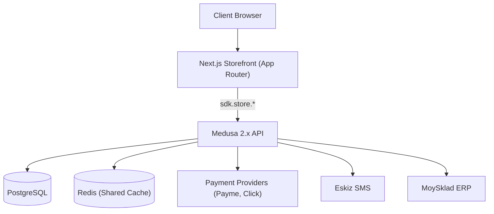
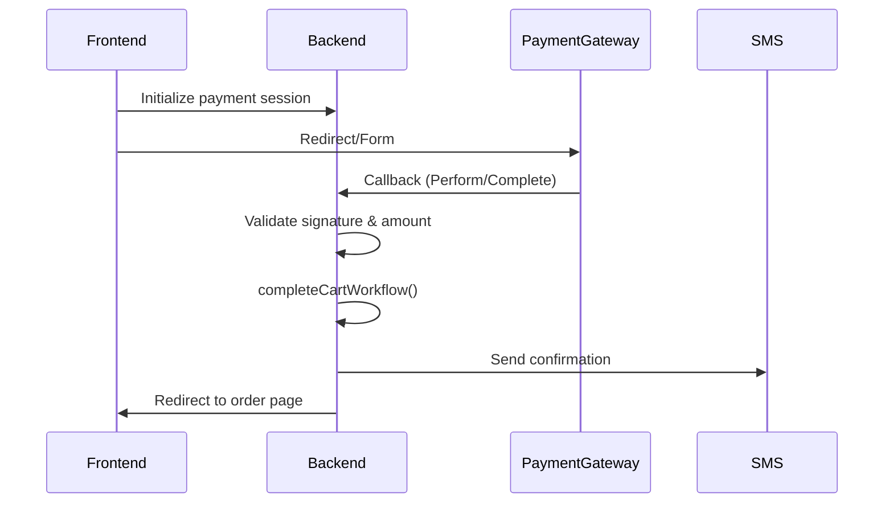

# Toolbox Architecture

> **Version**: 2.0  
> **Last Updated**: January 2026  
> **Status**: Production

---

## 1. System Overview

### 1.1 Business Purpose
A production-ready e-commerce platform for the **Toolbox** hardware brand, specialized for the Uzbekistan market.

### 1.2 Technology Stack
| Layer | Technology |
|-------|------------|
| **Storefront** | Next.js 14 (App Router, React Server Components) |
| **Backend** | Medusa 2.0 Framework |
| **Database** | PostgreSQL |
| **Cache** | Redis (Shared Cache + Workflows/Jobs/OTP) |
| **Search** | Meilisearch |
| **Storage** | Minio (S3-compatible) |
| **SMS** | Eskiz API |

### 1.3 Localization
- **Locales**: Russian (RU), Uzbek (UZ)
- **Primary Identifier**: Phone number (not email)
- **UI Strings**: `storefront/messages/{ru,uz}.json` via `next-intl`
- **Dynamic Content**: Stored in `metadata` fields with `title_ru`, `title_uz` pattern

---

## 2. Architecture Diagram



---

## 3. Core Domains

### 3.1 Catalog
- Managed in Medusa, synced with MoySklad for inventory
- Localized via metadata (`title_ru`, `description_uz`, etc.)
- Fetched via `getLocalizedField()` utility

### 3.2 Cart
- Persistent via server-side cookies
- Includes specialized recovery for completed sessions
- `retrieveCart` checks for `completed_at` to prevent stale states

### 3.3 Checkout (BTS-Only Delivery)
> [!IMPORTANT]
> **Standard street addresses are DISABLED.** Delivery is strictly to BTS Pickup Points.

1. **Address Entry**: Name + Phone only
2. **OTP Verification**: User must verify phone via SMS
3. **Auto-Register**: Creates customer account during checkout
4. **Payment**: Via Payme or Click gateways
5. **Delivery Cost**: Calculated client-side, paid separately at pickup

### 3.4 Payments
- **Providers**: Payme, Click (Uzbekistan)
- **Flow**: Backend-driven order creation
- **Rule**: Frontend NEVER calls `placeOrder` — backend handles via callbacks

### 3.5 Authentication
- **Model**: Phone-First with OTP
- **Technical Email**: `{phone}@phone.local` (internal use only)
- **OTP Storage**: Redis with atomic Lua scripts

---

## 4. Backend Architecture

### 4.1 Custom Modules (`backend/src/modules/`)

| Module | Purpose |
|--------|---------|
| `eskiz-sms` | Eskiz SMS notification provider |
| `moysklad` | MoySklad ERP integration (stock sync) |
| `payment-payme` | Payme payment gateway handler |
| `payment-click` | Click payment gateway handler |
| `minio-file` | Minio S3 file storage provider |
| `email-notifications` | Email notification templates |

### 4.2 Custom API Endpoints (`backend/src/api/`)

#### Store Endpoints (`/store/*`)

| Endpoint | Purpose |
|----------|---------|
| `/store/otp/request` | Send OTP code via SMS |
| `/store/otp/verify` | Verify OTP code |
| `/store/otp/reset-password` | Password recovery flow |
| `/store/otp/change-password` | Change password (with OTP) |
| `/store/otp/change-phone` | Change phone number (with OTP) |
| `/store/otp/send` | Generic OTP sending |
| `/store/auto-register` | Phone-based customer auto-registration |
| `/store/bts/regions` | BTS Express regions list |
| `/store/bts/shipping-method` | Attach shipping price to cart |
| `/store/banners` | Promotional banners API |
| `/store/quick-order` | Quick order (buy-in-one-click) |
| `/store/product-categories` | Custom category fetching |
| `/store/customer-by-phone` | Customer lookup by phone |
| `/store/payme` | Payme transaction handling |

#### Other Endpoints

| Endpoint | Purpose |
|----------|---------|
| `/click/callback` | Click payment callback |
| `/payme/callback` | Payme payment callback |
| `/health` | Health check |

### 4.3 Scheduled Jobs (`backend/src/jobs/`)

| Job | Schedule | Purpose |
|-----|----------|---------|
| `sync-moysklad-stock` | `*/15 * * * *` (every 15 min) | Sync inventory from MoySklad to Medusa |

### 4.4 Subscribers (`backend/src/subscribers/`)

| Subscriber | Event | Purpose |
|------------|-------|---------|
| `order-sms-handler.ts` | `order.*` | Format and send order SMS |
| `auto-translate-product.ts` | `product.created/updated` | Translate to UZ/RU |
| `auto-translate-category.ts` | `category.created/updated` | Translate to UZ/RU |
| `auto-translate-collection.ts` | `collection.created/updated` | Translate to UZ/RU |
| `invite-created.ts` | `invite.created` | Admin invite emails |
| `storefront-cache-revalidation.ts` | Various | Invalidate Next.js cache |

---

## 5. Storefront Architecture

### 5.1 Data Layer (`storefront/src/lib/data/`)

| File | Purpose |
|------|---------|
| `cart.ts` | Cart mutations and retrieval with stale recovery |
| `customer.ts` | Customer auth, registration, password flows |
| `bts.ts` | BTS Express regions, points, and pricing (Tariff 2025) |
| `products.ts` | Product listing and details |
| `categories.ts` | Category tree fetching |
| `collections.ts` | Collection fetching |
| `banners.ts` | Promotional banners |
| `orders.ts` | Order history |
| `regions.ts` | Region resolution |

### 5.2 Key Patterns

**Data Fetching**:
- All SDK calls wrapped in `React.cache()` for request memoization
- Use `revalidateTag()` for cache invalidation
- Never fetch directly in components — use `lib/data/*`

**Localization**:
- `getLocalizedField(metadata, field, locale, fallback)` for dynamic content
- `useTranslations()` for static UI strings

### 5.3 Caching Strategy

| Data Type | Revalidate | Tag | Cache Type |
|-----------|------------|-----|------------|
| Regions | Infinite (Manual) | `regions` | Data Cache |
| Collections | 3600s (1hr) | `collections` | Data Cache |
| Products | 300s (5min) | `products` | Data Cache |
| Banners | 600s (10min) | `banners` | Data Cache |
| Cart | 0 (Dynamic) | - | No Cache |

---

## 6. OTP Authentication System

### 6.1 OTP Purposes

| Purpose | Used For | TTL |
|---------|----------|-----|
| `register` | New account signup | 15 min |
| `reset_password` | Forgot password flow | 15 min |
| `change_password` | Change password in account | 15 min |
| `change_phone` | Change phone number | 15 min |
| `checkout` | Guest checkout auto-registration | 15 min |

### 6.2 OTP Flow

```
1. User enters phone → Request OTP
2. Backend stores code in Redis (TTL: 15 min)
3. Cooldown key set (TTL: 60 sec)
4. SMS sent via Eskiz
5. User enters code → Verify
6. Backend sets verified flag (TTL: 30 min)
7. Action performed → Flag consumed atomically
```

### 6.3 Redis Keys

```
otp:{phone}:{purpose}              → 6-digit code
otp_verified:{phone}:{purpose}     → verification flag
otp_attempts:{phone}               → rate limit counter
otp_cooldown:{phone}:{purpose}     → cooldown flag
```

---

## 7. Checkout & Orders Flow

### 7.1 Guest Checkout

1. **Contact Info**: Name + Phone (no address)
2. **OTP Verification**: 6-digit SMS code
3. **Auto-Register**: `/store/auto-register` creates customer
4. **BTS Selection**: Choose pickup point
5. **Payment**: Redirect to Payme/Click
6. **Callback**: Backend completes order
7. **SMS**: Confirmation + credentials sent

### 7.2 Payment Flow (Backend-Driven)



### 7.3 Delivery Model (BTS Postpaid)

> [!IMPORTANT]
> - **Online Payment** = Product cost ONLY
> - **Delivery Cost** = Paid separately at pickup
> - **Shipping total** is NEVER included in payment gateway amount

---

## 8. External Integrations

| Integration | Auth | Purpose |
|-------------|------|---------|
| **Payme** | Merchant ID + Secret | Payment gateway |
| **Click** | Service ID + Merchant ID | Payment gateway |
| **Eskiz SMS** | Bearer Token | SMS (OTP, order notifications) |
| **MoySklad** | Bearer Token | ERP stock synchronization |
| **BTS Delivery** | Zone-based pricing | Regional logistics |

---

## 9. Architectural Invariants

### MUST NOT be broken:

1. **Phone-as-ID**: No duplicate customers with different emails for same phone
2. **BTS-Only Delivery**: Never expose standard address inputs in checkout
3. **Stock Integrity**: Medusa always follows MoySklad counts
4. **OTP Atomicity**: All OTP operations use Redis atomic scripts
5. **Redis Cache**: Must be active — in-memory cache is PROHIBITED
6. **Backend Checkout**: Frontend `placeOrder` is BANNED for production

### Preferred Patterns:

- Use `lib/data` server actions for all mutations
- Keep regional business logic in custom Medusa Modules
- Use `metadata` for localized fields (no schema changes)
- All SDK queries must request `+metadata`

### Anti-patterns:

- Hardcoding secrets (use `process.env`)
- Storing state in in-memory Maps (use Redis)
- Mixing Locale and CountryCode in cart ID logic

---

## 10. Known Risks & Constraints

| Risk | Mitigation |
|------|------------|
| **No Address Fields** | UI relies on `metadata.bts_delivery` |
| **Custom Shipping Prices** | `bts/shipping-method` workaround — sensitive to updates |
| **Phone-Email Shim** | `<phone>@phone.local` must be consistent |
| **SMS Delivery Failure** | Auto-registration fails by design (credentials must reach user) |
| **Large Catalog Sync** | 10k+ products may require job splitting |

---

## 11. Directory Structure

```
medusajs-2.0-for-railway-boilerplate/
├── backend/
│   ├── src/
│   │   ├── api/           # Custom API routes
│   │   ├── jobs/          # Scheduled jobs
│   │   ├── lib/           # Shared utilities
│   │   ├── modules/       # Custom modules
│   │   ├── subscribers/   # Event handlers
│   │   └── workflows/     # Medusa workflows
│   └── medusa-config.ts
├── storefront/
│   ├── src/
│   │   ├── app/           # Next.js App Router pages
│   │   ├── lib/           # Data layer, utilities
│   │   ├── modules/       # UI components
│   │   └── middleware.ts  # Locale/auth middleware
│   └── messages/          # i18n translations
├── docs/                  # Additional documentation
└── ARCHITECTURE.md        # This file
```

---

## 12. Development Setup

```bash
# Backend
cd backend
npm install
npm run dev

# Storefront  
cd storefront
npm install
npm run dev
```

**Environment Variables**: See `.env.example` in each directory.

---

## 13. Quick Reference

### Key Files

| Purpose | Path |
|---------|------|
| Backend config | `backend/medusa-config.ts` |
| Stock sync job | `backend/src/jobs/sync-moysklad-stock.ts` |
| OTP routes | `backend/src/api/store/otp/` |
| Cart logic | `storefront/src/lib/data/cart.ts` |
| Customer auth | `storefront/src/lib/data/customer.ts` |
| BTS pricing | `storefront/src/lib/data/bts.ts` |
| Translations RU | `storefront/messages/ru.json` |
| Translations UZ | `storefront/messages/uz.json` |
